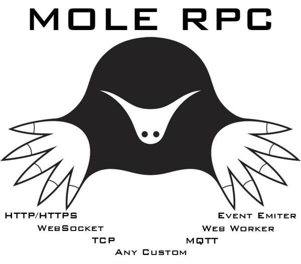

# mole-rpc

Tiny transport agnostic JSON-RPC 2.0 client and server which can work both in NodeJs, Browser, Electron etc

[](https://badge.fury.io/js/mole-rpc)
[](https://travis-ci.org/koorchik/node-mole-rpc)
[](https://snyk.io/test/github/koorchik/node-mole-rpc?targetFile=package.json)



## Table of contents

-   [Features](#features)
-   [Motivation](#motivation)
-   [Basic usage](#basic-usage)
    -   [Simple example with websocket transport](#simple-example-with-websocket-transport)
-   [API examples](#api-examples)
    -   [Proxified Client](#proxified-client)
    -   [Client (without Proxy support)](#client-without-proxy-support)
    -   [Server (expose instance)](#server-expose-instance)
    -   [Server (expose functions)](#server-expose-functions)
    -   [Error Handling](#error-handling)
-   [Advanced usage](#advanced-usage)
-   [Use cases](#use-cases)
-   [How to create own transport?](#how-to-create-own-transport)

## Features

-   **Transport agnostic** (works with HTTP, MQTT, Websocket, Browser post message etc). Here is the list of supported transports - https://www.npmjs.com/search?q=keywords:mole-transport
-   **Zero dependencies**. Mole-RPC itself has zero dependencies.
-   **Works both in NodeJs and in a browser** (both client anf server). For example, you can use it to send request to webworker in your browser.
-   **Bidirectional websocket connections support** via WS tranport. For example, you want a JSON RPC server which handles remote calls but the same time you want to send commands in opposite direction using the same connection.So, you can use connection initiated by any of the sides for the server and the client the same time.
-   **Server can use several transports the same time**. For example, you want an RPC server that accepts connections from your local workers by TCP and from Web browser by websocket. You can pass as many transports as you wish.
-   **Lightweight**
-   **Modern API**. Totally based on Promises and supports Proxified interface
-   **Supports all features of JSON-RPC 2.0** (batches, notifications etc)
-   **Easy to create own transport**. Transports have simple API as possible, so it is very easy to add a new transport. See ["How to create own transport?"](how-to-create-own-transport) section.

## Motivation

Yet another JSON-RPC library? Why do we need it? The reality, that there is no transport agnostic JSON-RPC library for nodejs. One of our projects required JSON RPC over MQTT and unfortunetely we were not able to find a good solution. 

**Key issues with existing libraries:**

1. No multiple transports support.
2. Not possible to add a new transport.
3. For some possible, but you need to duplicate almost all protocol logic in every transport.
4. Bidirectional websocket connections are not supported.
5. Reverse connection (when server connect to client via websocket and after that the client send commands to the server)
6. Leaking transport abtractions (like topic name in MQTT needs to be the same as method name).
7. Huge codebase with tons of classes (JSON RPC should not look like this)
8. No promise based API.
9. Everything is bundled to one large package with high level of coupling.
10. Bugs, not tests.
11. etc 

Mole-RPC solves all of the issues described above.

## Basic usage

This module is transport agnostics. So, [you can choose any transport you need](https://www.npmjs.com/search?q=keywords:mole-transport)

### Simple example with websocket transport 

In this example, we use WebSocketServer for RPC server but you you can use simple WS server transport as well. This can be useful for the case when server connects to client (you can bypass firefall in this way).

**Server**
```js
const MoleServer = require('mole-rpc/MoleServer');
const TransportServerWSS = require('mole-rpc-transport-ws/TransportServerWSS');
const WebSocket = require('ws');
const WSS_PORT = 12345;

function sum(a, b) { return a + b }
function multiply(a, b) { return a * b } 

async function main() {
  const server = new MoleServer({ 
    transports: prepareTransports() 
  });

  server.expose({ sum, multiply });
  await server.run();
}

function prepareTransports() {
  return [
    new TransportServerWSS({
      wss: new WebSocket.Server({ 
        port: WSS_PORT 
      })
    })
  ];
}

main().catch(console.error);
```

**Client (with Proxy support)**

```js
const MoleClient = require('mole-rpc/MoleClientProxified');
const X = require('mole-rpc/X');
const TransportClientWS = require('mole-rpc-transport-ws/TransportClientWS');

const WebSocket = require('ws');
const WSS_PORT = 12345;

async function main() {
  const client = new MoleClient({
    requestTimeout: 1000,
    transport: prepareTransport()
  });

  try {
      console.log( await client.sum(2, 3) );
  } catch (error) {
    if (error instanceof X.ExecutionError) {
      console.log('ERROR', error.data);
    } else {
      throw error;
    }
  }
}

function prepareTransport() {
  return new TransportClientWS({
    wsBuilder: () => new WebSocket(`ws://localhost:${WSS_PORT}`)
  });
}

main().then(console.log, console.error);
```

## API examples

### Proxified client

If you use modern JavaScript you can use proxified client.
It allows you to do remote calls very similar to local calls

```javascript
import MoleClientProxified from 'mole-rpc/MoleClientProxified';

// choose any transports here
// https://www.npmjs.com/search?q=keywords:mole-transport
const transport = new TransportClient();
const calculator = new MoleClientProxified({ transport });

const result1 = await calculator.sum(1, 3);
const result2 = await calculator.asyncSum(2, 3);

// Send JSON RPC notification (fire and forget)
// server will send no response
await calculator.notify.sum(3, 2);
```

### Client (without Proxy support)

```javascript
import MoleClient from 'mole-rpc/MoleClient';

// choose any transports here
// https://www.npmjs.com/search?q=keywords:mole-transport
const transport = new TransportClient();
const client = new MoleClient({ transport });

const result1 = await client.callMethod('sum', [1, 3]);
const result2 = await client.callMethod('sum', [2, 3]);

// Send JSON RPC notification (fire and forget)
// server will send no response
await client.notify('sum', [2, 3]);
```

### Server (expose instance)

You can expose instance directly.
Methods which start with underscore will not be exposed.
Built-in methods of Object base class will not be exposed.

```javascript
import MoleServer from 'mole-rpc/MoleServer';

class Calculator {
  sum(a, b) {
    return a + b;
  }

  asyncSum(a, b) {
    return new Promise((resolve, reject) => {
        resolve(this.sum(a, b));
    });
  }

  _privateMethod() {
    // will not be exposed
  }
}

const calculator = new Calculator();

// choose any transports here
// https://www.npmjs.com/search?q=keywords:mole-transport
const transports = [new TransportServer()];

const server = new MoleServer({ transports: [] });
server.expose(calculator);

await server.run();
```

### Server (expose functions)

You can expose functions directly

```javascript
import MoleServer from "mole-rpc/MoleServer";

function sum(a, b) {
  return a+b;
}

function asyncSum(a, b) {
  return new Promise((resolve, reject) {
    resolve( sum(a, b) );
  });
}

// choose any transports here
// https://www.npmjs.com/search?q=keywords:mole-transport
const transports = [ new TransportServer() ];

const server = new MoleServer({ transports });
server.expose({
  sum,
  asyncSum
});

await server.run();
```

### Error Handling

When an rpc call encounters an error, the server will return an object with an error code. See [JSON RPC 2.0 Specification](https://www.jsonrpc.org/specification#error_object) for details.

Getting an error Mole RPC Client will throw (reject promise) a corresponding exception.

List of available exception classes:

* Base
  * MethodNotFound
  * InvalidRequest
  * InvalidParams
  * InternalError
  * ParseError
  * ServerError - custom server errors
    * RequestTimout - Request exceeded maximum execution time
    * ExecutionError - Method has returned an error. 

Every exception object has following properties:

1. "code" - numeric code from the spec
2. "message" - human readable message.
3. "data" - additional data. Used only by ExecutionError, contains error returned by method 

**How to return an error from method?**

Nothing special required. Just reject promise or throw an exception.

```js

function divide(a, b) {
  if (b == 0) throw "devision by zero";
  // throw 'new Error("devision by zero")' will behave the same
  return a / b; 
} 

function loadUser(userId) {
  ...
  // you can throw an object
  return Promise.reject({ error: 'NOT_EXISTING_USER'})
}

server.expose({ divide, loadUser });
```

**How to handle the error?**

Nothing special. Just catch the exception.

```js
const X = require('mole-rpc/X');

async function main() {
  ... 

  try {
      await client.divide(2, 3);
  } catch (error) {
    if (error instanceof X.ExecutionError) {
      console.log('METHOD RETURNED ERROR', error.data);
    } else if (error instanceof X.RequestTimout) {
      console.log('METHOD EXCEEDED ALLOWED EXECUTION TIME');
    } else {
      throw error;
    } 
  }
}
```

## Advanced usage

```javascript

// Proxified client: explicit call
await calculator.callMethod.sum(1, 2); // the same as "calculator.sum(1, 2)"
// Can be usefull if your server method is a reserverd name.
// For example to make a call to remote "notify" method.
await proxifiedClient.callMethod.notify("Hello");

// Proxified client: run request in parallel
const promises = [
  calculator.sum(1, 2);
  calculator.notify.sum(1, 2);
];

const results = await Promise.all(promises);

// Simple client: run in parallel
const promises = [
  client.callMethod('sum', [1, 2]);
  client.notify('sum', [1, 2]);
];

const results = await Promise.all(promises);

// Simple client: run batch
const results = await client.runBatch([
  // [methodName, params, mode]
  ['sum', [1, 3]],
  ['sum', [2, 5], 'notify'],
  ['sum', [7, 9], 'callMethod'], // "callMethod" is optional
]);


// Result structure
[
  {success: true, result: 123},
  null, // no response for notification
  {success: false, error: errorObject}
];

```

## Use cases

### Case 1: Easy way to communicate with web-workers in your browser

To communicate with web worker, in most cases, you will try to simulate JSON RPC having "id", "method", "params" in each request and "id", "result" in each response.

With Mole RCP there is no need to use custom hacks. Just use [mole-rpc-transport-webworker](https://www.npmjs.com/package/mole-rpc-transport-webworker). 


### Case 2: Bypass firewall

You have a device (or service) in local network and want to manage it. You cannot get to it from Internet, as the device is hidden behind NAT. But your device can connect to your internet server. So, with Mole RPC your device (RPC Server) can connect to the your internet server (RPC Client) and after that the internet server will be able to call methods on the devices hidden behind NAT.

Here is an example  - https://github.com/koorchik/node-mole-rpc-transport-ws/tree/master/examples/server-connects-to-client 

This case is rather hard to implement with other JSON RPC modules but with Mole RPC it works by design. 


### Case 3: Microservices via message broker

You have a lot microservices and you want allow them to communicate with each other. The best solutions here is to have a message broker. Mole RPC has MQTT transport which will allow to setup the communication easily.

See, [mole-rpc-transport-mqtt](https://www.npmjs.com/package/mole-rpc-transport-mqtt)

### Case 4: Lightweight Inter process communication

Websocket is a good options for it. With websocker transport you can connect browser to server and the same time it suitable for connecting to server processes. It is not only option, you not limited to use any transport you wish. 

### Case 5: Multi transport mode (HTTP, HTTPS, WS the same time, for example)

You can pass multiple transports to MoleServer. This transport can be of different types. For example, you can expose the same methods via MQTT and WebSockets the same time.

## How to create own transport?

Transports have simple API as possible, so it is very easy to add a new transport. MoleRPC has strong separation between protocol handler and transports. Transports know nothing about what is inside payload. Therefore, they are very simple. Usually, is is just two classes with 1-2 methods.

The best way to start is just to look at source code of existing implemenations - https://www.npmjs.com/search?q=keywords:mole-transport 

Moreover, we have created an [AutoTester](https://www.npmjs.com/package/mole-rpc-autotester) for transports. Use [AutoTester](https://www.npmjs.com/package/mole-rpc-autotester) to cover 95% of cases and just add several tests to cover transport specific logic like reconnections etc.