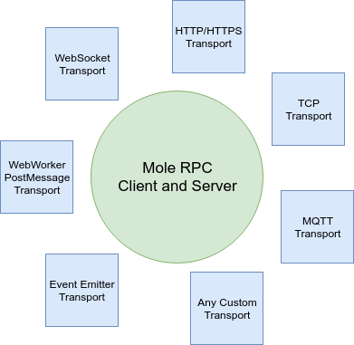

# mole-rpc

Tiny transport agnostic JSON-RPC 2.0 client and server which can work both in NodeJs, Browser, Electron etc

[](https://badge.fury.io/js/mole-rpc)
[](https://travis-ci.org/koorchik/node-mole-rpc)
[](https://snyk.io/test/github/koorchik/node-mole-rpc?targetFile=package.json)

IMPORTANT: Library is in active development till version 1.0. API changes are possible.

[![NPM Version][npm-image]][npm-url] [![NPM Downloads][downloads-image]][downloads-url] [![Package Quality][quality-image]][quality-url] [![Travis CI][travis-image]][travis-url] [![Known Vulnerabilities][snyk-image]][snyk-url]



## Table of contents

-   [Features](#features)
-   [Basic usage](#basic-usage)
    -   [Client (with Proxy support)](#client-with-proxy-support)
    -   [Client (without Proxy support)](#client-without-proxy-support)
    -   [Server (expose instance)](#server-expose-instance)
    -   [Server (expose functions)](#server-expose-functions)
-   [Advanced usage](#advanced-usage)
-   [Use cases](#use-cases)

## Features

-   **Transport agnostic** (works with HTTP, MQTT, Websocket, Browser post message etc). Here is the list of supported transports - https://www.npmjs.com/search?q=keywords:mole-transport
-   **Zero dependencies**. Mole-RPC itself has zero dependencies.
-   **Works both in NodeJs and in a browser** (both client anf server). For example, you can use it to send request to webworker in your browser.
-   **Bidirectional websocket connections support** via WS tranport. For example, you want a JSON RPC server which handles remote calls but the same time you want to send commands in opposite direction using the same connection.So, you can use connection initiated by any of the sides for the server and the client the same time.
-   **Server can use several transports the same time**. For example, you want an RPC server that accepts connections from your local workers by TCP and from Web browser by websocket. You can pass as many transports as you wish.
-   **Lightweight**
-   **Modern API**. Totally based on Promises and supports Proxified interface
-   **Supports all features of JSON-RPC 2.0** (batches, notifications etc)
-   **Easy to create own transport**. Transports have simple API as possible, so it is very easy to add a new transport.

## Basic usage

You a lot of working examples you can find here too
https://github.com/koorchik/node-mole-rpc-examples

### Client (with Proxy support)

If you use modern JavaScript you can use proxified client.
It allows you to do remote calls very similar to local calls

```javascript
import MoleClientProxified from 'mole-rpc/MoleClientProxified';

// choose any transports here
// https://www.npmjs.com/search?q=keywords:mole-transport
const transport = new TransportClient();
const calculator = new MoleClientProxified({ transport });

const result1 = await calculator.sum(1, 3);
const result2 = await calculator.asyncSum(2, 3);

// Send JSON RPC notification (fire and forget)
// server will send no response
await calculator.notify.sum(3, 2);
```

### Client (without Proxy support)

```javascript
import MoleClient from 'mole-rpc/MoleClient';

// choose any transports here
// https://www.npmjs.com/search?q=keywords:mole-transport
const transport = new TransportClient();
const client = new MoleClient({ transport });

const result1 = await client.callMethod('sum', [1, 3]);
const result2 = await client.callMethod('sum', [2, 3]);

// Send JSON RPC notification (fire and forget)
// server will send no response
await client.notify('sum', [2, 3]);
```

### Server (expose instance)

You can expose instance directly.
Methods which start with underscore will not be exposed.
Built-in methods of Object base class will not be exposed.

```javascript
import MoleServer from 'mole-rpc/MoleServer';

class Calculator {
    sum(a, b) {
        return a + b;
    }

    asyncSum(a, b) {
        return new Promise((resolve, reject) => {
            resolve(this.sum(a, b));
        });
    }

    _privateMethod() {
        // will not be exposed
    }
}

const calculator = new Calculator();

// choose any transports here
// https://www.npmjs.com/search?q=keywords:mole-transport
const transports = [new TransportServer()];

const server = new MoleServer({ transports: [] });
server.expose(calculator);

await server.run();
```

### Server (expose functions)

You can expose functions directly

```javascript
import MoleServer from "mole-rpc/MoleServer";

function sum(a, b) {
   return a+b;
}

function asyncSum(a, b) {
   return new Promise((resolve, reject) {
      resolve( sum(a, b) );
   });
}

// choose any transports here
// https://www.npmjs.com/search?q=keywords:mole-transport
const transports = [ new TransportServer() ];

const server = new MoleServer({ transports });
server.expose({
   sum,
   asyncSum
});

await server.run();
```

## Advanced usage

```javascript


// Proxified client: explicit call
await calculator.callMethod.sum(1, 2); // the same as "calculator.sum(1, 2)"
// Can be usefull if your server method is a reserverd name.
// For example to make a call to remote "notify" method.
await proxifiedClient.callMethod.notify("Hello");

// Proxified client: run request in parallel
const promises = [
   calculator.sum(1, 2);
   calculator.notify.sum(1, 2);
];

const results = await Promise.all(promises);

// Simple client: run in parallel
const promises = [
   client.callMethod('sum', [1, 2]);
   client.notify('sum', [1, 2]);
];

const results = await Promise.all(promises);

// Simple client: run batch
const results = await client.runBatch([
   ['sum', [1, 3]],
   ['sum', [2, 5], 'notify'],
   ['sum', [7, 9], 'callMethod'], // "callMethod" is optional
   [methodName, params, mode]
]);


// Result structure
[
   {success: true, result: 123},
   null, // no response for notification
   {success: false, error: errorObject}
];

```

## Use cases

### Case 1: Easy way to communicate with web-workers in your browser

Usually,

### Case 2: Bypass firewall

### Case 3: Microservices via message broker

### Case 4: Lightweight Inter process communication

### Case 5: Multi transport mode (HTTP, HTTPS, WS the same time, for example)

## API

### MoleClient

### MoleServer

## How to create own transport?
